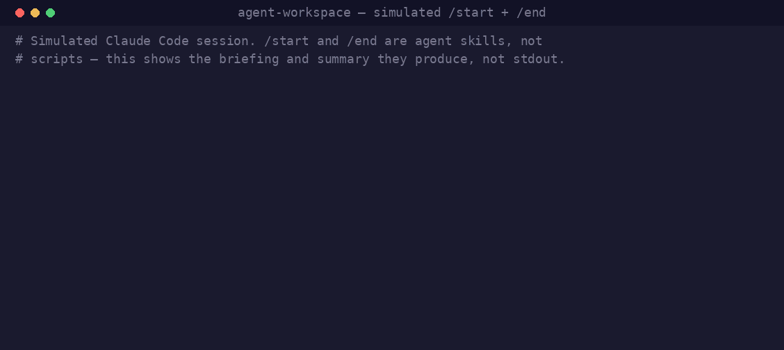

# agent-workspace

> **Maintenance mode.** This project is stable and receives security fixes. New features aren't planned, but issues and pull requests are still welcome.

Memory and hygiene for agent workspaces — the lifecycle skills that give an AI coding agent
a persistent, self-maintaining sense of *where a project is*.

<p align="center">
  
</p>

Agent sessions are ephemeral: close the terminal and the context is gone. These six skills
fix that with a small set of state files and the commands that keep them fresh — so every
session starts where the last one left off, decisions are recorded with the paths not
taken, and parallel sessions don't quietly corrupt each other.

## The skills

| Skill | What it does | Invocation |
|-------|--------------|------------|
| `start` | Load state, flag staleness, brief the top priorities/deadlines | user-only |
| `update` | Mid-session checkpoint — log progress, touch state only if it moved | user-only |
| `end` | Log the session, roll state, append the decision log, propose memory, check git | user-only |
| `today` | Morning heartbeat — staleness, deadlines, memory curation | user-only |
| `reconcile` | Tripwire scan for multi-session drift (read-only, proposes fixes) | model-invocable |
| `recover` | Find orphaned worktrees / stale branches, offer approval-gated cleanup | model-invocable |

The four lifecycle skills are `disable-model-invocation: true` — you time them, and they
cost zero ambient context. `reconcile` and `recover` stay model-invocable on purpose: the
scans are read-only, so auto-triggering on a "something feels off" moment is the feature.
Every action that changes files or git state is proposed and gated on your approval.

## Install

Each skill directory is a complete, standalone installation. Copy the ones you want into a
project's `.claude/skills/`:

```bash
# one skill
cp -r skills/start your-project/.claude/skills/start

# all of them
mkdir -p your-project/.claude/skills
cp -r skills/* your-project/.claude/skills/
```

Use `~/.claude/skills/` instead of a project path to make them available everywhere. The
directory name becomes the command (`/start`, `/reconcile`, …); changes hot-reload within a
session.

Then bootstrap the state files from the templates:

```bash
mkdir -p state
cp templates/current.md templates/decisions.md \
   templates/weekly-priorities.md templates/blockers.md state/
```

`current-log.md`, `heartbeat-log.md`, and the dated `sessions/*.md` logs are created
automatically on first write.

## Configuration

The skills read an optional `workspace.yaml` at the **project root**. When it's absent,
everything falls back to sensible defaults, so no config is required.

| Key | Default | Meaning |
|-----|---------|---------|
| `state_dir` | `state/` | Directory holding the state files |
| `sessions_dir` | `sessions/` | Directory holding dated session logs |
| `task_files` | `TODO.md` | File (or list) scanned for deadlines and overdue items |
| `staleness.current_days` | `3` | Flag `current.md` when older than this |
| `staleness.weekly_days` | `5` | Flag `weekly-priorities.md` when older than this |
| `staleness.blockers_days` | `7` | Flag `blockers.md` when older than this |

See [`workspace.example.yaml`](workspace.example.yaml) for a copy-paste starting point and
[`docs/state-model.md`](docs/state-model.md) for the full model — the state files, the
`Last Updated` chain protocol, the decision-log schema, default-branch detection, and how
each skill behaves outside a git repository.

## The validator

`scripts/validate_skill.py` (vendored from
[agent-skill-builder](https://github.com/conorbronsdon/agent-skill-builder)) machine-checks
every skill here against the skill-authoring standards — frontmatter, description budget,
argument wiring, tool-grant scoping, side effects on model-invocable skills, broken links,
body length. CI (`.github/workflows/test.yml`) runs it against `skills/*` on every push and
PR. Run it yourself:

```bash
python3 scripts/validate_skill.py skills/*
```

## Relationship to claude-code-skills

These skills graduated from the
[claude-code-skills](https://github.com/conorbronsdon/claude-code-skills) collection:
`session-management` (which bundled `/start`, `/update`, `/end`, `/today`) was split into
per-command skills, and `reconcile` + `recover` moved here too. This repo is now their home;
the collection's copies track it.


## Disclaimer

*This is an independent personal project, not affiliated with, sponsored by, or endorsed by any company. All views expressed are my own.*

## License

MIT — see [LICENSE](LICENSE).
